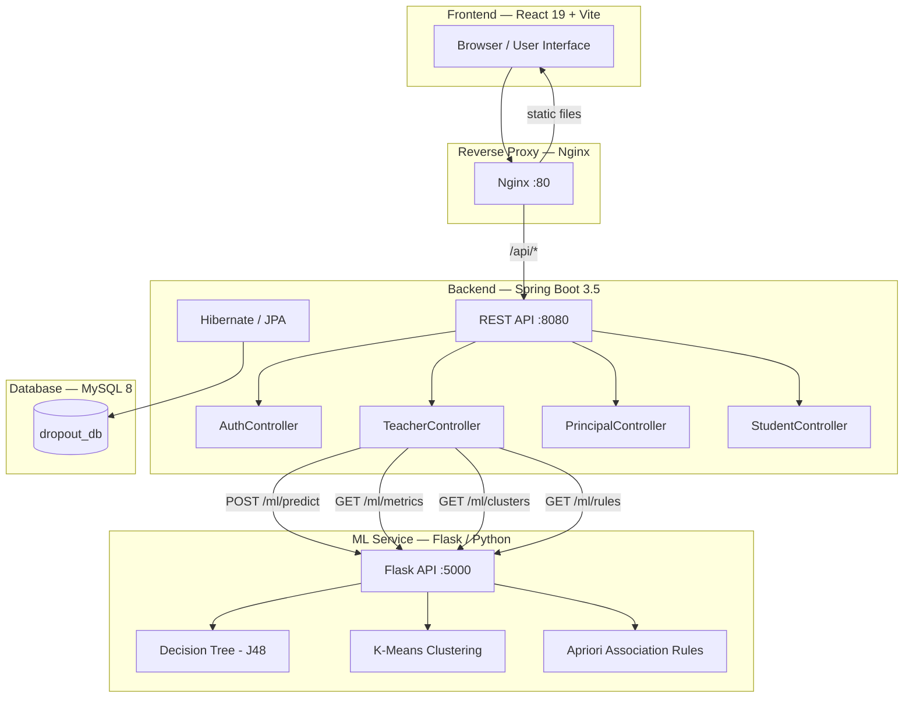
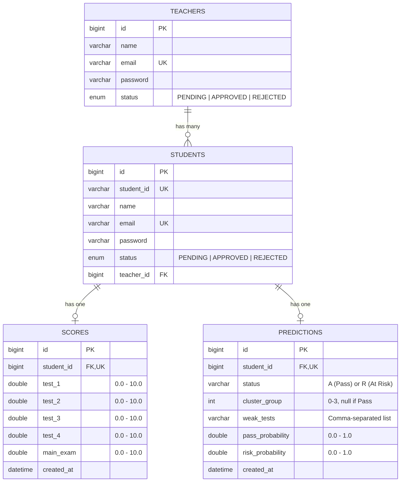
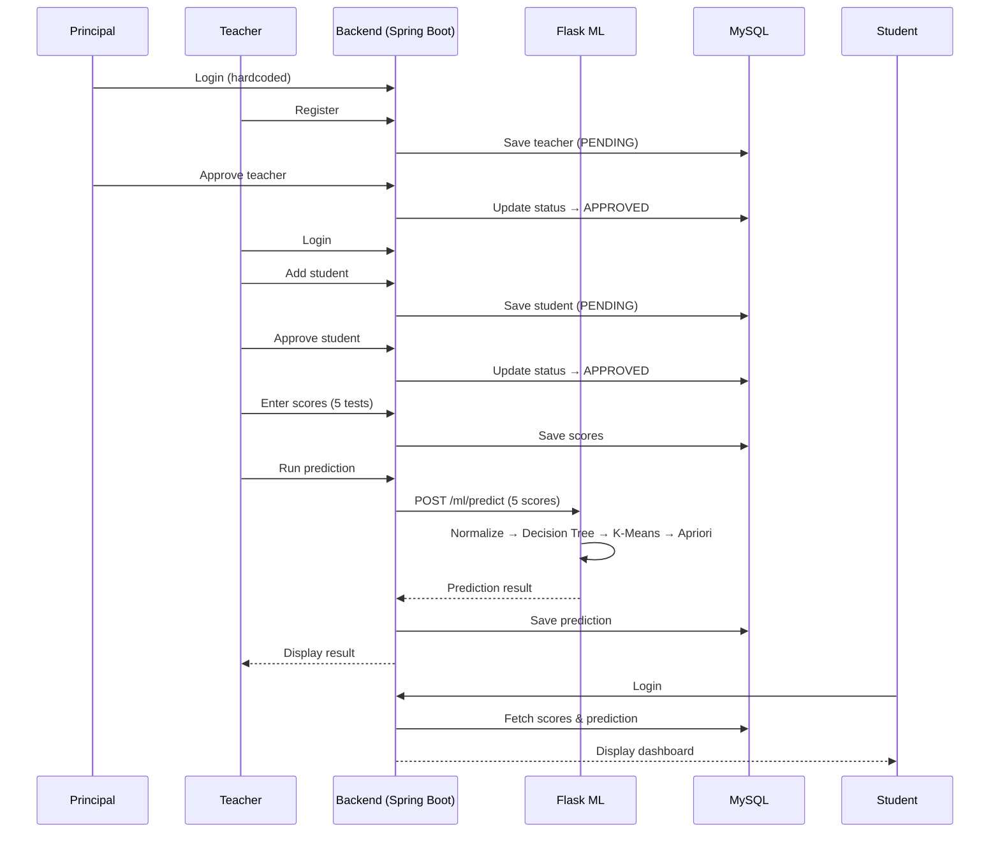

# 🧩 System Architecture

Ever wonder how the app actually works behind the scenes? 

Building a web app is a lot like **running a restaurant**. Let's break down the technical jargon into a simple analogy!

### 🍔 The Restaurant Analogy

1. **Frontend (The Dining Room & Menu):** 
   * *Tech:* React, Vite, Tailwind CSS
   * This is what you see and click on. Just like a beautiful menu in a restaurant, the frontend is designed to be easy to read and interact with.
2. **Backend (The Waiter):**
   * *Tech:* Spring Boot, Java
   * When you click "Run Prediction", the Frontend hands your request to the Backend. The Backend acts like a waiter—it takes your order (the student's scores), walks back to the kitchen, and eventually brings you the result.
3. **Database (The Pantry & Order History):**
   * *Tech:* MySQL
   * The waiter needs to know if the student exists or what their past scores were. They look this up in the Database, which is a giant digital filing cabinet holding all the school's records.
4. **ML Service (The Head Chef):**
   * *Tech:* Flask, Python, Machine Learning
   * This is the brain! When the waiter brings the scores to the kitchen, the Head Chef (the AI) looks at them, applies complex recipes (algorithms), and says, *"This student is at risk of dropping out."* The waiter takes this information and brings it back to you!

### High-Level Architecture Diagram

```text
                                  [ NGINX ]
                                  (Port 80)
                                      │
                 ┌────────────────────┴────────────────────┐
                 ▼                                         ▼
   ┌───────────────────────────┐             ┌───────────────────────────┐
   │       FRONTEND APP        │             │      SPRING BOOT API      │
   │  (React + Vite + Tailwind)│             │  (Java 17, Hibernate/JPA) │
   │      Port: 3000           │             │      Port: 8080           │
   └───────────────────────────┘             └─────────────┬─────────────┘
                                                           │
                        ┌──────────────────────────────────┤
                        ▼                                  ▼
          ┌───────────────────────────┐      ┌───────────────────────────┐
          │      FLASK ML API         │      │       MYSQL DATABASE      │
          │  (Python 3.11, scikit)    │      │         (MySQL 8)         │
          │      Port: 5000           │      │      Port: 3306           │
          └───────────────────────────┘      └───────────────────────────┘
```

### Detailed Component Flow


---

## 📁 Project Structure

```
CODE/
├── docker-compose.yml              # Orchestrates all 4 services
├── .env                            # MySQL credentials
├── INSTALLATION.md                 # Setup guide
├── ARCHITECTURE.md                 # This file
│
├── BACKEND/demo/                   # Spring Boot Backend
│   ├── Dockerfile
│   ├── pom.xml                     # Maven dependencies
│   └── src/main/
│       ├── java/com/example/demo/
│       │   ├── Controller/
│       │   │   ├── AuthController.java       # Login & teacher registration
│       │   │   ├── TeacherController.java    # Student mgmt, scores, predictions
│       │   │   ├── PrincipalController.java  # Teacher mgmt, statistics
│       │   │   └── StudentController.java    # Student profile, scores view
│       │   ├── Repository/                   # JPA data access layer
│       │   └── entity/
│       │       ├── Teacher.java              # Teacher entity
│       │       ├── Student.java              # Student entity
│       │       ├── Score.java                # Test scores entity
│       │       └── Prediction.java           # ML prediction results
│       └── resources/
│           ├── application.properties        # Local dev config
│           ├── application-docker.properties # Docker config
│           └── flask-ml/                     # Flask ML Service
│               ├── Dockerfile
│               ├── app.py                    # Flask API
│               ├── requirements.txt
│               └── data/                     # Pre-trained ML models
│                   ├── decision_tree_model.pkl
│                   ├── kmeans_model.pkl
│                   ├── scaler.pkl
│                   ├── label_encoder.pkl
│                   ├── association_rules.json
│                   └── model_metadata.json
│
└── FRONTEND/my-react-app/          # React Frontend
    ├── Dockerfile
    ├── nginx.conf                  # Nginx reverse proxy config
    ├── package.json
    └── src/
        ├── Home/                   # Landing, Login, Register pages
        ├── Principal/              # Principal dashboard & management
        ├── Teacher/                # Teacher dashboard & tools
        └── Student/                # Student dashboard & views
```

---

## 🗄 Database Schema

The database `dropout_db` has **4 tables**, auto-created by Hibernate:



---

## 🤖 The "Brain" (Machine Learning Pipeline)

The system doesn't just guess; it uses three mathematical "recipes" (algorithms) working together:

### 1. The Decision Maker (J48 Decision Tree)
*   **What it does:** It looks at the 5 test scores and makes a firm decision: **Pass** or **At Risk**.
*   *Analogy:* Imagine a flowchart that says, "If Test 1 is below 7, go left. If Test 2 is above 7, go right." The AI learned this flowchart by studying 700 past students.

### 2. The Organizer (K-Means Clustering)
*   **What it does:** If a student is marked "At Risk", this algorithm groups them into one of 4 severity levels so teachers know who needs help first.
*   *Analogy:* It's like sorting laundry into "Delicate," "Normal," and "Heavy Duty." It finds students who have similar struggles and puts them in the same group.

| Severity Level | What it means |
|---------|------------|
| 0 | **Very Low Scorer** — needs urgent support in all subjects |
| 1 | **Borderline Fail** — slightly below passing |
| 2 | **Average Weak** — moderate scores but missing the mark |
| 3 | **Low Main Exam** — does okay on tests, but fails the big exam |

### 3. The Pattern Finder (Apriori Association Rules)
*   **What it does:** It looks for hidden relationships between different tests. 
*   *Analogy:* Just like Amazon says "People who bought a flashlight also bought batteries," this algorithm says "Students who fail Test 1 almost always fail Test 3." This helps teachers catch problems early!

---

## 📊 Data Flow — How Data Enters the System

### Step 1: Principal Logs In (Hardcoded Account)
```
Email:    principal@school.com
Password: principal123
```
The principal account is pre-configured in the system code.

### Step 2: Teacher Registers
- Teacher goes to the **Register** page and fills in Name, Email, Password
- Account is created with status **PENDING**
- Principal logs in → **Teacher Management** → Approves the teacher
- Teacher can now log in

### Step 3: Teacher Adds Students
- Teacher logs in → **Student Management** → Adds student (Name, Email, Student ID, Password)
- Student account is created with status **PENDING**
- Teacher approves the student → Student can now log in

### Step 4: Teacher Enters Test Scores
- Teacher logs in → **Score Entry** → Selects a student
- Enters 5 scores (each between **0.0 and 10.0**):
  - Test 1, Test 2, Test 3, Test 4, Main Exam

### Step 5: Teacher Runs Prediction
- Teacher logs in → **Predictions** → Selects a student → Clicks "Predict"
- Backend sends the 5 scores to Flask ML → Gets prediction result
- Result is saved in the database and displayed:
  - **Status:** Pass or At Risk
  - **Probability:** Pass % and Risk %
  - **Risk Group:** (if At Risk) which cluster they belong to
  - **Weak Tests:** Which tests scored below 7.0
  - **Matching Rules:** Association rule patterns

### Step 6: Student Views Their Data
- Student logs in → Dashboard shows their scores and prediction results
- Students can also update their profile

### Visual Flow



---

## 🌐 API Endpoints

### Auth (`/api/auth`)
| Method | Endpoint | Description |
|--------|----------|-------------|
| POST | `/login` | Login for all roles (Principal/Teacher/Student) |
| POST | `/teacher/register` | Register a new teacher |

### Teacher (`/api/teacher`)
| Method | Endpoint | Description |
|--------|----------|-------------|
| POST | `/students` | Add a new student |
| GET | `/students/{teacherId}` | Get all students for a teacher |
| PUT | `/students/approve/{id}` | Approve student account |
| PUT | `/students/reject/{id}` | Reject student account |
| POST | `/scores` | Enter test scores for a student |
| POST | `/predict/{studentId}` | Run ML prediction on a student |
| GET | `/predictions/{teacherId}` | Get all predictions |
| GET | `/model/metrics` | Get ML model accuracy metrics |
| GET | `/clusters` | Get K-Means cluster information |
| GET | `/rules` | Get association rules |
| GET/PUT | `/profile/{teacherId}` | View/update teacher profile |

### Principal (`/api/principal`)
| Method | Endpoint | Description |
|--------|----------|-------------|
| GET | `/teachers` | Get all teachers |
| GET | `/teachers/pending` | Get pending teachers |
| PUT | `/teachers/approve/{id}` | Approve teacher account |
| PUT | `/teachers/reject/{id}` | Reject teacher account |
| GET | `/monitor` | Monitor all students across teachers |
| GET | `/statistics` | Get system-wide statistics |

### Student (`/api/student`)
| Method | Endpoint | Description |
|--------|----------|-------------|
| GET | `/scores/{studentId}` | View own scores |
| GET | `/prediction/{studentId}` | View own prediction |
| GET/PUT | `/profile/{studentId}` | View/update profile |

### Flask ML (`/ml`)
| Method | Endpoint | Description |
|--------|----------|-------------|
| POST | `/predict` | Run prediction on 5 scores |
| GET | `/metrics` | Get model accuracy |
| GET | `/clusters` | Get cluster centroids |
| GET | `/rules` | Get association rules |
| GET | `/health` | Health check |

---

## 🐳 Docker Services

| Service | Image | Internal Port | Host Port |
|---------|-------|--------------|-----------|
| `mysql` | mysql:8.0 | 3306 | 3307 |
| `flask-ml` | code-flask-ml | 5000 | 5001 |
| `backend` | code-backend | 8080 | 8080 |
| `frontend` | code-frontend | 80 | 3000 |

---

## 🛠 Tech Stack Summary

| Layer | Technology |
|-------|-----------|
| Frontend | React 19, Vite 7, Tailwind CSS 4, React Router 7, Recharts, Chart.js |
| Backend | Spring Boot 3.5.11, Java 17, Maven, Hibernate/JPA |
| ML Service | Python 3.11, Flask, scikit-learn, NumPy, Gunicorn |
| Database | MySQL 8.0 |
| Reverse Proxy | Nginx (Alpine) |
| Containerization | Docker, Docker Compose |
